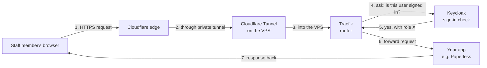
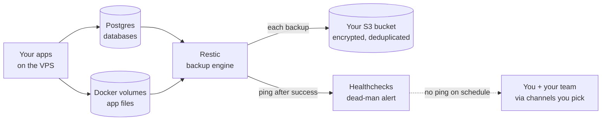

A plain-language tour of what's running on `your VPS`
and how the pieces fit together. You don't need to memorize any of
this -- it's here so that if something misbehaves, you have a mental
model for where to look first.

## The one-paragraph version

When a staff member types one of your URLs into their browser, the
request enters through **Cloudflare** (which hides your VPS's real
address), crosses a private tunnel into `your VPS`,
hits a router (**Traefik**) that figures out which app it's for,
then gets stopped at **Keycloak** -- your identity layer -- to prove
the person is logged in and in the right team. Only then does the
request reach the actual application. Meanwhile, another process
quietly backs everything up to your S3 bucket with each backup, and a
monitor pings each service every minute to catch outages before you
do.

## The services at a glance

| Service | What it does for you |
|---|---|
| **Cloudflare** | Your public front door. Hides the VPS's IP, issues HTTPS certificates, and absorbs bad traffic. |
| **Cloudflare Tunnel** | A private link between Cloudflare and your VPS. Nothing on `your VPS` is exposed directly to the internet. |
| **Tailscale** | Your private way onto the box. A mesh network only authorised machines are on -- it is how you (and anyone you invite to help) SSH into `your VPS` to run maintenance or investigate, and your way back in if the web dashboards ever fail. Public SSH is closed, so without Tailscale (or Cloudflare, for staff traffic) nothing reaches the VPS. You stay in control: Tailscale can be disabled or removed by you at any time from your VPS provider's console (or physically, for on-premises hardware). |
| **Traefik** | The switchboard. Reads the URL in each request and routes it to the right application. |
| **Keycloak** | Your identity server. Handles sign-in, password resets, and team-based access control. The only login page your users ever see. |
| **Portainer** | The deployment panel. Where new apps are installed and updated. You can watch logs here. |
| **Apps (yours)** | Whatever you've deployed through Portainer -- one container per app, running on a private Docker network. |
| **Gatus** | The health monitor. Probes every service every minute from two angles: internally (is the container up?) and externally (is the whole path from Cloudflare to the app still working?). |
| **Healthchecks** | The notification hub. Every alert from Gatus (services down) and the backup engine (missed backup) lands here, and you wire it to the channels you want -- email, Slack, Discord, ntfy, and ~30 others. See [How alerts reach you](#how-alerts-reach-you). |
| **catena-admin** | Your dashboard. Collects links and status into one page, and carries the one-click actions (the "sync now" button, for example) on its **Actions** tab, gated to the `administrators` group. |
| **Restic -> S3** | The backup engine. Takes an encrypted, deduplicated snapshot of your data with each backup, pushes it to a storage bucket you own. |

## How a page request flows

This is what happens when a staff member opens, say,
`https://paperless.yourdomain.com`:

If step 5 says "no" (the user isn't signed in, or isn't in the right
team), they're bounced to the Keycloak sign-in page instead -- they
never see the app until they prove who they are.

## How your data is protected

Two things worth knowing:

- The S3 bucket is **yours**. You set the credentials on the VPS at
  install, and the account and billing relationship with the storage
  provider stay in your name -- nothing about the backups depends on
  anyone else.
- The backup is **encrypted on the VPS before it leaves**, using a key
  you hold separately from the VPS itself (part of your
  [recovery keyset](/en/disaster-prevention/)). Even someone with full
  access to the S3 bucket cannot read the backup without that key.

## How monitoring catches problems

Gatus runs two probes per service every minute:

- **Internal probe** -- does the container reply on the private Docker
  network? If not, the app itself is broken.
- **Public probe** -- does the full path (Cloudflare -> Tunnel -> Traefik
  -> Keycloak -> app) return the expected response? If this fails but
  the internal probe succeeds, something between Cloudflare and your
  app is misbehaving -- a DNS record, the tunnel, the sign-in layer.

Two probes, two different failure stories. When you see an alert, the
one that fires tells you which half of the suite to look at first.

## How alerts reach you

Every Gatus probe that goes red sends a notification through
**Healthchecks** at [`heartbeat.yourdomain.com`](https://heartbeat.yourdomain.com).
Each service has its own check, named `gatus-<service>` (e.g.
`gatus-actualbudget`, `gatus-traefik-internal`), so the push you receive
names the failing service directly. Recoveries notify too, so you know
when a problem has cleared without having to refresh Gatus.

By default, alerts push through **ntfy** (a free push-notification
service, auto-configured at setup, no account required). Point it at
your phone and **add any other channels you want** -- one-time setup:

1. Sign in to [`heartbeat.yourdomain.com`](https://heartbeat.yourdomain.com)
   (same Keycloak login as every other service).
2. **Settings -> Integrations -> Add Integration**. Pick the channel you
   want: Email, Slack, Discord, Telegram, Microsoft Teams, Pushover,
   ntfy, Matrix, PagerDuty, a webhook, or any of the ~30 others. Paste
   the target (email address, Slack webhook URL, etc.) and save. New
   integrations automatically apply to every `gatus-*` check -- you
   don't have to tick them one-by-one.
3. If you want a channel on *some* services but not others, open the
   specific `gatus-<service>` check, click **Integrations**, and tick
   only the ones you want for that service. Useful if e.g. the staff
   portal going down should page you by SMS but the internal dashboard
   shouldn't.
4. Do the same for **Daily backup ping** if you want to hear about
   missed backups too.

Removing a channel is the same flow in reverse. The built-in default
channel isn't exposed in this UI -- it stays attached regardless of
what you add or remove. New services that start being monitored (e.g. an app
you just deployed) get their own check on the first failure, with your
channels automatically attached.

## Updates and rollback

Your apps + the infrastructure they run on get refreshed on a weekly
schedule -- outside business hours, with an automatic rollback if
anything starts failing.

Not every app gets the same treatment. It depends on how the image
tag is pinned in the app's configuration:

| Tag looks like...   | Example              | Gets auto-updated? |
|---|---|---|
| Full version      | `paperless:2.12.3`   | **Yes** -- with auto-rollback on failure. |
| Major-only pin    | `postgres:16-alpine` | No. System-pinned; ignored by the weekly updater. |
| Floating          | `nginx:latest`       | No. Unsafe to touch unsupervised. |

For apps on a full version pin, each service can optionally tag a
policy in its compose:

- `vps.auto-update=patch` *(default)* -- accept bug-fix releases only
  (e.g., 2.12.3 -> 2.12.4).
- `vps.auto-update=minor` -- also accept feature releases within the
  same major line (2.12.3 -> 2.13.0).
- `vps.auto-update=major` -- accept anything newer, including major
  version jumps.
- `vps.auto-update=off` -- skip this service entirely.

If you set the label on an app with a floating or major-only tag, it
is silently ignored -- the system's pinning rule wins. This is
deliberate: auto-rollback needs a known-good prior version to revert
to, and a floating tag doesn't provide one.

**What happens when an update breaks:**

1. Gatus health probes catch the regression within ~3 minutes
   (internal + public probes both).
2. The updater reverts the service to the previous known-good
   version and redeploys it.
3. The bad version is remembered -- next week's run picks the *next*
   version up, not the one that just broke.
4. You are paged through **Healthchecks** with the service
   name + the version that failed. The running version of every
   service is visible on the **Gatus monitoring surface** at
   `monitor.<your-zone>` -- a quarantined service shows the prior
   pinned tag with the bad version annotated next to it.

You don't have to do anything. The app comes back on its own, so you
look into the root cause at your own pace -- it is not a 3 a.m.
emergency.

If you'd rather skip a week of updates entirely (e.g., you're
demoing something and don't want anything to change), you can
**pause** the updater from the **Actions** tab of your dashboard --
status stays visible on the Gatus surface until you resume.

## Where you fit in

You don't have to touch Cloudflare, Traefik, the tunnel, or the
backup engine. Your day-to-day surface is:

- **Keycloak** -- add or remove staff, reset passwords, assign people
  to teams (see [Manage users and roles](/en/manage-users-and-roles/)).
- **Portainer** -- deploy new apps with access-control labels (see
  [Manage apps](/en/manage-apps/)).
- **Your dashboard** -- glance at service health and pinned links.
- **Healthchecks** -- add the notification channels you want alerts on
  (see [How alerts reach you](#how-alerts-reach-you)).
- **The dashboard's Actions tab** (administrators only) -- click a
  named action to run a pre-defined operation (like "resync the
  dashboard now"). Visible to staff in the `administrators` Keycloak
  group; non-admin staff see the tile but hitting it bounces them
  through login.

Everything else runs on its own. If any of it stops running, Gatus
pages you before you find out from a staff complaint.
