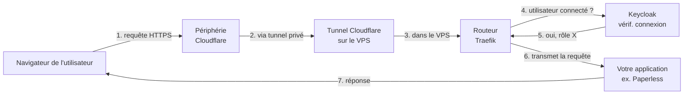
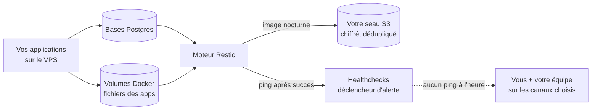

Une visite guidée, en langage clair, de ce qui tourne sur
`your VPS` et de la façon dont les pièces s'emboîtent.
Vous n'avez rien à mémoriser — c'est ici pour que, si quelque chose
cloche, vous ayez un modèle mental du premier endroit à regarder.

## La version en un paragraphe

Quand un membre du personnel tape une de vos URLs dans son navigateur,
la requête entre par **Cloudflare** (qui cache l'adresse réelle de
votre VPS), traverse un tunnel privé jusqu'à `your VPS`,
frappe un routeur (**Traefik**) qui déduit à quelle application elle
est destinée, puis est arrêtée par **Keycloak** — votre couche
d'identité — pour vérifier que la personne est bien connectée et dans
la bonne équipe. Ce n'est qu'ensuite que la requête atteint
l'application elle-même. Pendant ce temps, un autre processus
sauvegarde discrètement tout vers votre seau S3 chaque jour, et un
moniteur teste chaque service chaque minute pour attraper les pannes
avant vous.

## Les services en bref

| Service | Ce qu'il fait pour vous |
|---|---|
| **Cloudflare** | Votre porte d'entrée publique. Cache l'IP du VPS, émet les certificats HTTPS, absorbe le trafic malveillant. |
| **Tunnel Cloudflare** | Un lien privé entre Cloudflare et votre VPS. Rien sur `your VPS` n'est exposé directement à Internet. |
| **Tailscale** | La porte arrière privée de votre opérateur. Un réseau maillé réservé aux machines autorisées — c'est par là que l'opérateur rejoint `your VPS` pour les mises à jour et les enquêtes. SSH public est fermé ; sans Tailscale (ou Cloudflare, pour le trafic du personnel), rien n'atteint le VPS. Vous gardez le contrôle : Tailscale peut être désactivé ou retiré par vous à tout moment depuis la console de votre fournisseur VPS (ou physiquement, pour du matériel sur site). Si vous ne savez pas comment faire, vous ne devriez pas. |
| **Traefik** | Le standard téléphonique. Lit l'URL de chaque requête et l'oriente vers la bonne application. |
| **Keycloak** | Votre serveur d'identité. Gère la connexion, les réinitialisations de mot de passe et le contrôle d'accès par équipe. La seule page de connexion que vos utilisateurs verront. |
| **Dokploy** | Le panneau de déploiement. Là où les nouvelles applications sont installées et mises à jour. Vous pouvez consulter les journaux ici. |
| **Vos applications** | Tout ce que vous avez déployé via Dokploy — un conteneur par application, tournant sur un réseau Docker privé. |
| **Gatus** | Le moniteur de santé. Teste chaque service toutes les minutes sous deux angles : à l'interne (le conteneur répond-il ?) et à l'externe (le chemin complet de Cloudflare à l'application fonctionne-t-il ?). |
| **Healthchecks** | Le centre de notifications. Toutes les alertes de Gatus (services en panne) et du moteur de sauvegarde (image nocturne manquée) arrivent ici, et vous les branchez aux canaux que vous voulez — courriel, Slack, Discord, ntfy, et une trentaine d'autres. Voir [Comment les alertes vous parviennent](#comment-les-alertes-vous-parviennent). |
| **Homepage** | Le tableau de bord. Rassemble les liens et les statuts sur une seule page. |
| **OliveTin** | Actions en un clic, restreintes au groupe `administrators` (opérateur + équipe administratrice). Le bouton « synchroniser maintenant », par exemple. |
| **Restic → S3** | Le moteur de sauvegarde. Prend une image chiffrée et dédupliquée de vos données chaque nuit, l'envoie vers un seau de stockage que vous possédez. |

## Le parcours d'une requête

Voici ce qui se passe quand un membre du personnel ouvre, par exemple,
`https://paperless.yourdomain.com` :

Si l'étape 5 répond « non » (l'utilisateur n'est pas connecté, ou
n'est pas dans la bonne équipe), il est redirigé vers la page de
connexion Keycloak — il ne voit jamais l'application avant d'avoir
prouvé son identité.

## Comment vos données sont protégées

Deux points à retenir :

- Le seau S3 est **le vôtre**. Votre opérateur configure les
  identifiants sur le VPS, mais le compte et la relation de
  facturation avec le fournisseur de stockage vous appartiennent.
  Si vous changez d'opérateur un jour, les sauvegardes restent avec
  vous.
- La sauvegarde est **chiffrée sur le VPS avant d'en sortir**, avec
  une clé que votre opérateur conserve séparément. Même quelqu'un
  avec un accès complet au seau S3 ne peut pas lire la sauvegarde
  sans cette clé.

## Comment la surveillance attrape les problèmes

Gatus exécute deux sondes par service chaque minute :

- **Sonde interne** — le conteneur répond-il sur le réseau Docker
  privé ? Si non, l'application elle-même est en panne.
- **Sonde publique** — le chemin complet (Cloudflare → Tunnel →
  Traefik → Keycloak → application) retourne-t-il la réponse
  attendue ? Si celle-ci échoue mais que la sonde interne réussit,
  quelque chose entre Cloudflare et votre application dysfonctionne —
  un enregistrement DNS, le tunnel, la couche de connexion.

Deux sondes, deux scénarios de panne distincts. Quand une alerte
tombe, celle qui se déclenche vous indique quelle moitié de la suite
regarder en premier.

## Comment les alertes vous parviennent

Chaque sonde Gatus qui passe au rouge envoie une notification via
**Healthchecks** à [`checks.yourdomain.com`](https://checks.yourdomain.com).
Chaque service a sa propre vérification, nommée `gatus-<service>`
(p. ex. `gatus-actualbudget`, `gatus-homepage-internal`), donc la
notification reçue nomme directement le service en panne. Les
rétablissements déclenchent aussi une notification, donc vous savez
quand le problème est réglé sans avoir à rafraîchir Gatus.

Votre opérateur est notifié par défaut — il reçoit les alertes sur son
téléphone via **ntfy** (un service de notifications push gratuit,
configuré automatiquement à l'installation, aucun compte requis côté
client). **Vous ajoutez vos propres canaux** — configuration unique,
sans intervention de l'opérateur :

1. Connectez-vous à [`checks.yourdomain.com`](https://checks.yourdomain.com)
   (même identifiant Keycloak que pour les autres services).
2. **Settings → Integrations → Add Integration**. Choisissez le canal
   voulu : courriel, Slack, Discord, Telegram, Microsoft Teams,
   Pushover, ntfy, Matrix, PagerDuty, un webhook, ou n'importe lequel
   des ~30 autres. Collez la cible (adresse courriel, URL webhook
   Slack, etc.) et enregistrez. Les nouvelles intégrations s'appliquent
   automatiquement à toutes les vérifications `gatus-*` — pas besoin de
   les cocher une par une.
3. Si vous voulez un canal sur *certains* services seulement, ouvrez la
   vérification `gatus-<service>` spécifique, cliquez sur
   **Integrations**, et cochez uniquement ceux voulus pour ce service.
   Utile si p. ex. le portail du personnel en panne doit vous joindre
   par SMS mais le tableau de bord interne non.
4. Faites pareil pour **Daily backup ping** si vous voulez être
   notifié des sauvegardes manquées.

Le retrait d'un canal se fait de la même façon. Le canal par défaut
de l'opérateur n'est pas exposé dans cette interface — il reste en
place peu importe ce que vous ajoutez ou retirez. Les nouveaux services
surveillés (p. ex. une application que vous venez de déployer) reçoivent
leur propre vérification à la première panne, avec vos canaux
automatiquement rattachés.

## Mises à jour et retour en arrière

Vos applications et l'infrastructure qui les fait tourner sont
rafraîchies selon un horaire hebdomadaire — dimanche matin avant
les heures de bureau, avec un retour en arrière automatique si
quelque chose se met à échouer.

Toutes les applications ne sont pas traitées de la même façon. Ça
dépend de comment le tag d'image est épinglé dans la configuration
de l'application :

| Le tag ressemble à…   | Exemple              | Mise à jour auto ? |
|---|---|---|
| Version complète      | `paperless:2.12.3`   | **Oui** — avec retour en arrière auto en cas d'échec. |
| Épingle majeure seule | `postgres:16-alpine` | Non. Géré par l'opérateur ; ignoré par la mise à jour hebdomadaire. |
| Flottant              | `nginx:latest`       | Non. Dangereux à toucher sans surveillance. |

Pour les applications épinglées à une version complète, chaque
service peut optionnellement étiqueter une politique dans son
fichier compose Dokploy :

- `vps.auto-update=patch` *(défaut)* — accepte uniquement les
  correctifs (p. ex. 2.12.3 → 2.12.4).
- `vps.auto-update=minor` — accepte aussi les versions mineures
  dans la même série majeure (2.12.3 → 2.13.0).
- `vps.auto-update=major` — accepte tout ce qui est plus récent,
  y compris les sauts de version majeure.
- `vps.auto-update=off` — saute complètement ce service.

Si vous mettez l'étiquette sur une app avec un tag flottant ou
majeur-seul, elle est **silencieusement ignorée** — la règle gérée
par l'opérateur l'emporte. C'est délibéré : un retour en arrière
automatique a besoin d'une version précédente connue-bonne, et un
tag flottant ne nous en donne pas.

**Ce qui se passe à 3 h du matin quand une mise à jour casse :**

1. Les sondes de santé Gatus détectent la régression en ~3 minutes
   (sondes interne ET publique).
2. La mise à jour revient au service à la version connue-bonne
   précédente et le redéploie.
3. La mauvaise version est mémorisée — la prochaine exécution essaie
   la version *suivante*, pas celle qui vient de casser.
4. Votre opérateur est alerté via **Healthchecks** avec le nom du
   service et la version qui a échoué. La version exécutée par
   chaque service est visible sur la **surface de monitoring
   Gatus** à `monitor.<votre-zone>` — un service en quarantaine
   affiche le tag épinglé précédent avec la mauvaise version
   annotée à côté.

Vous n'avez rien à faire. L'application revient d'elle-même.
L'opérateur enquête à un rythme d'heures de bureau, pas à 3 h.

Si vous préférez sauter une semaine de mises à jour (p. ex. vous
êtes en démo et rien ne doit changer), l'opérateur peut **mettre
en pause** la mise à jour depuis le panneau d'actions OliveTin — le
statut reste visible sur la surface Gatus jusqu'à la reprise.

## Votre rôle

Vous n'avez pas à toucher Cloudflare, Traefik, le tunnel ni le moteur
de sauvegarde. Votre surface d'interaction quotidienne est :

- **Keycloak** — ajouter ou retirer du personnel, réinitialiser des
  mots de passe, assigner les personnes aux équipes (voir
  [Ajouter / retirer des utilisateurs](/how-to-add-users/)).
- **Dokploy** — déployer de nouvelles applications avec des étiquettes
  de contrôle d'accès (voir
  [Déployer des applications](/how-to-deploy-apps/)).
- **Homepage** — coup d'œil rapide sur la santé des services et les
  liens épinglés.
- **Healthchecks** — ajouter les canaux de notification que vous
  souhaitez recevoir (voir
  [Comment les alertes vous parviennent](#comment-les-alertes-vous-parviennent)).
- **OliveTin** (administrateurs uniquement) — cliquer sur un bouton
  nommé pour déclencher une action que votre opérateur a
  pré-approuvée (comme « resynchroniser le tableau de bord
  maintenant »). Visible aux membres du personnel dans le groupe
  Keycloak `administrators` ; le personnel non-administrateur voit
  la tuile sur le tableau de bord mais y accéder le redirige vers
  l'écran de connexion.

Tout le reste tourne tout seul. Si quelque chose s'arrête, Gatus vous
alerte avant qu'un membre du personnel ne vous le signale.
